## Hi there 👋 I'm Andrew

🏫 Ph.D. student in the [College of Earth, Ocean, and Atmospheric Sciences](https://ceoas.oregonstate.edu/) at Oregon State University 
🌎 Using big Earth data to better understand our oceans, atmosphere, and climate 
💻 Building open source science with open source software 
🌐 Self-taught full stack developer leveraging web development to share my science and software 
🌊 Read more about me on my website at [sourcedepth.com](https://sourcedepth.com) 
📧 Reach me at [scherand@oregonstate.edu](mailto:scherand@oregonstate.edu) or at [andrew@sourcedepth.com](mailto:andrew@sourcedepth.com) 

  

